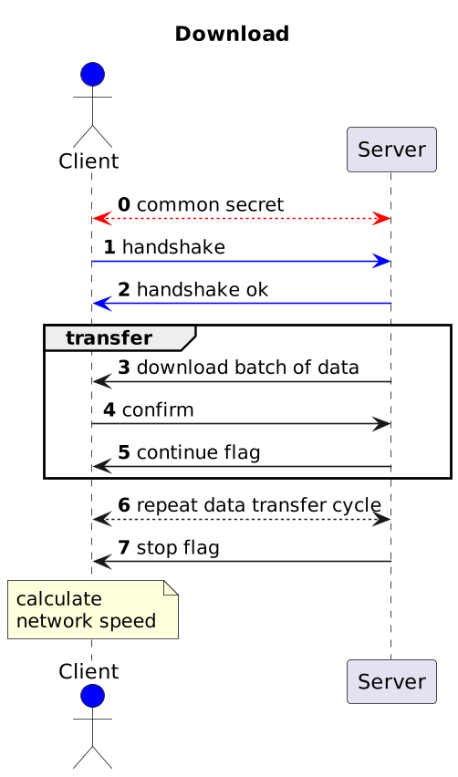
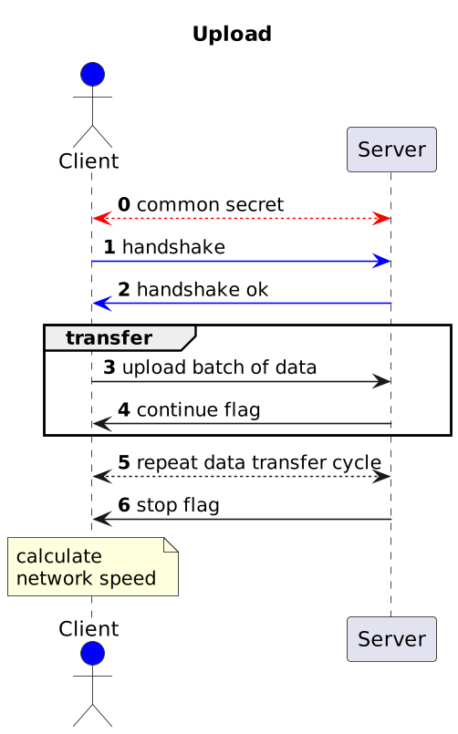

# Documentation

- The server-side controls the flow
- The client-side calculates the final speed
- There is a minor overhead due to signature and control messages

Sequence diagrams:

|                     |                   |
|---------------------|-------------------|
|  |  |

## Handshake

Authorization token format (123 bytes):

```
+--------+--------+------+------+-----------+-----------+
| action | client |  IP  | salt | timestamp | signature |
+--------+--------+------+------+-----------+-----------+
|    1   |    2   |  16  |  32  |     8     |    64     |
+--------+--------+------+------+-----------+-----------+

where:
  - action:    1 byte, 0 - download, 1 - upload
  - client:    2 bytes, client ID (uint16)
  - IP:        16 bytes, client IP address
  - salt:      32 bytes, random salt
  - timestamp: 8 bytes, unix timestamp (big endian int64), synchronized period is 30 seconds
  - signature: 64 bytes, sha512 hash signature
```

## Data header

After handshake both sides know the order of data receiving and sending.
Every data transfer block starts with a header (80 bytes):

```
+------+------+-----------+-----------+
| size | salt | timestamp | signature |
+------+------+-----------+-----------+
|   8  |  32  |     8     |    32     |
+------+------+-----------+-----------+

where:
  - size:      8 bytes, block data size in bytes (big endian int64)
  - salt:      32 bytes, random salt
  - timestamp: 8 bytes, unix timestamp (big endian int64), synchronized period is 30 seconds
  - signature: 32 bytes, sha256 hash signature
```

After what the block follows with the specified size and random data.

## Confirmation response

After data block the server-side sends confirmation message.
It's a message with format (73 bytes):

```
+------+------+-----------+-----------+
| flag | salt | timestamp | signature |
+------+------+-----------+-----------+
|   1  |  32  |     8     |    32     |
+------+------+-----------+-----------+

where:
  - flag:      1 byte, 0 - continue, 1 - stop
  - salt:      32 bytes, random salt
  - timestamp: 8 bytes, unix timestamp (big endian int64), synchronized period is 30 seconds
  - signature: 64 bytes, sha256 hash signature
```

If `flag=1` then server connection will be closed.
